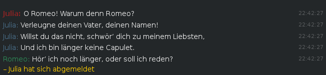

Dark Adium Message Style
===============================

This is a simple dark Adium message style for Empathy using Adwaita-dark.
It is based on Gnomes [Classic theme](https://git.gnome.org/browse/empathy/tree/data/themes/Classic.AdiumMessageStyle).

Variants
--------

Classic:  


Enhanced:  
  
(currently just timestamps for messages added)


Installation
------------

```sh
mkdir -p ~/.local/share/adium/message-styles && cd $_
git clone https://github.com/inta/dark-adium-message-style.git Dark.AdiumMessageStyle
```
